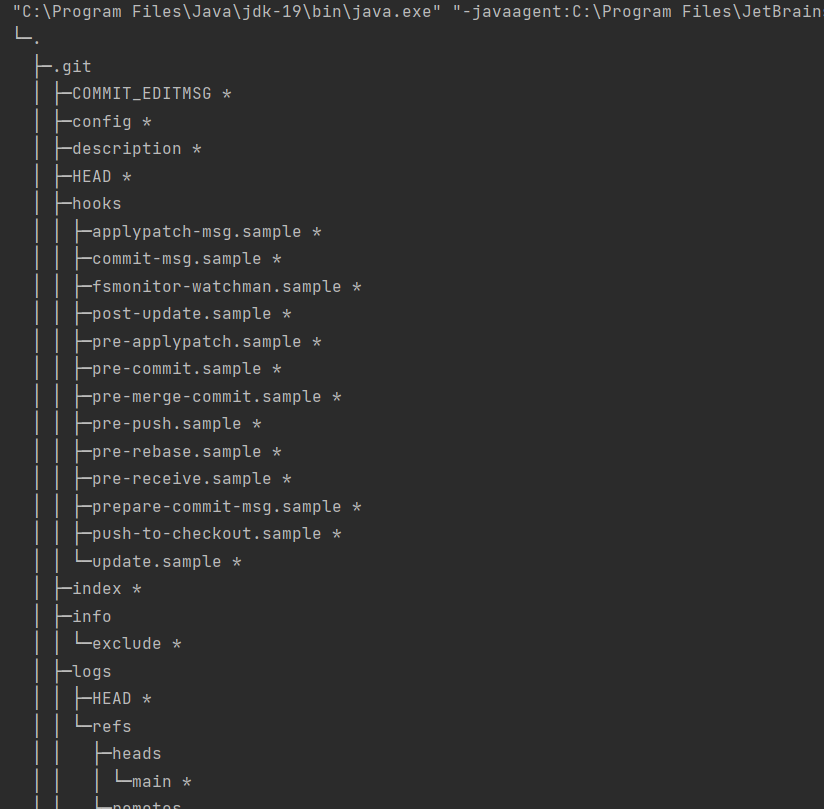

1. Написать функцию, создающую резервную копию всех файлов в директории во вновь созданную папку ./backup

Во избежание рекурсивного копирования содержимого папки backup она создается не в текущей директории, а в соседней

2. Доработайте класс Tree и метод print который мы разработали на семинаре. Ваш метод должен распечатать полноценное дерево директорий и файлов относительно корневой директории.

К названиям файлов добавлен символ "*"
